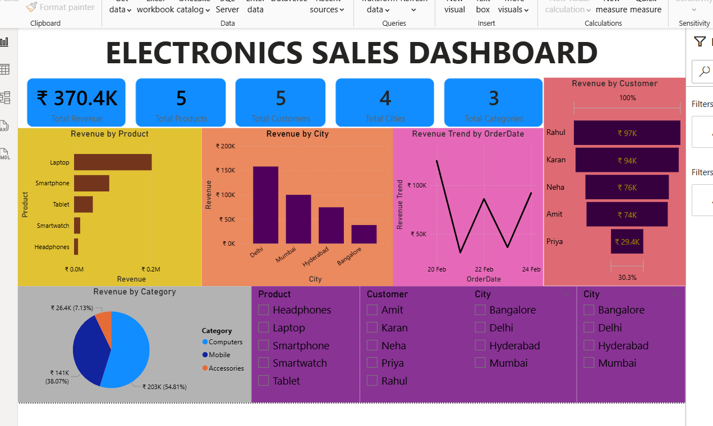

# Product Revenue Data Analysis

## Objective
Analyze product sales data to understand revenue distribution across products, cities, and categories.

## Tools Used
- Excel
- SQL
- Python (Pandas, Matplotlib)
- Power BI

## Dataset
The dataset contains product-level sales information including:
- Product
- Category
- City
- Revenue

## Analysis Performed
- Calculated total revenue
- Analyzed revenue by product
- Compared revenue across cities
- Evaluated category-wise revenue distribution
- Created visualizations for business insights

## Key Insights
- Laptop product generates the highest revenue than others
- Revenue distribution varies significantly across cities
- Computers category dominates overall sales performance
- Product-level analysis helps identify top-performing items
- Rahul has the highest revenue among all other customers

## Visualizations
- Bar chart: Revenue by Product
- Pie chart: Revenue by Category
-etc....

## Files in Repository
- Dataset.xlsx — Dataset
- queries.sql — SQL analysis queries
- analysis.py — Python analysis and visualization
- Dashboard.pbix — Power BI dashboard
- 
